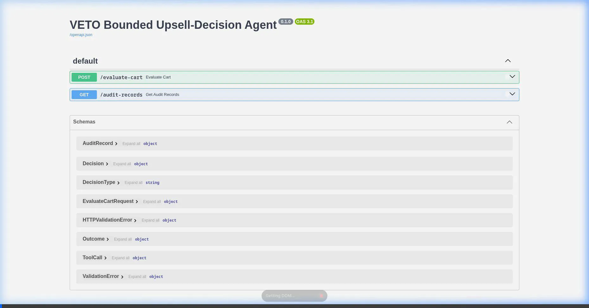
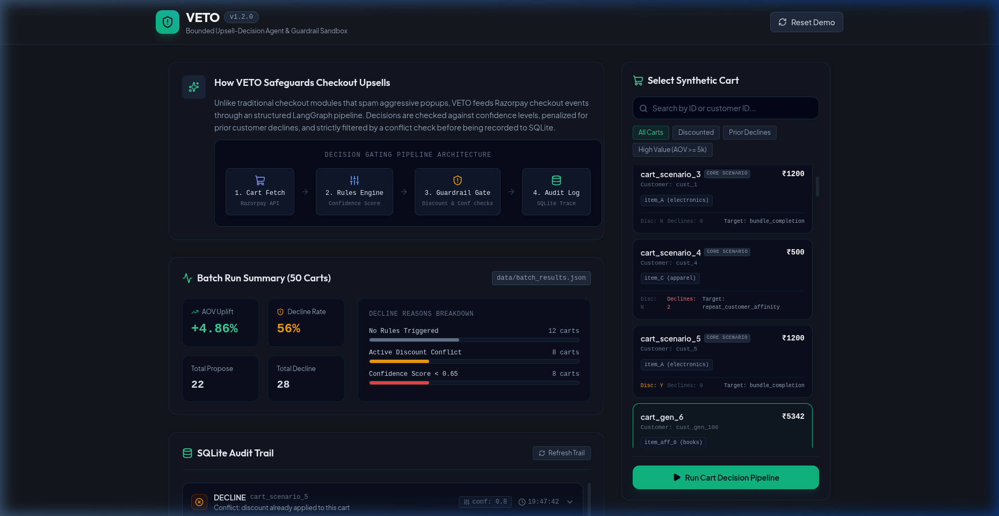

# VETO — Bounded Upsell-Decision Agent

Merchants lose significant potential revenue from missed checkout upsell opportunities, yet deploying naive upsell bots often backfires, eroding customer trust, showing irrelevant offers, and causing logic conflicts with existing discounts. VETO addresses this by introducing a bounded, guardrail-gated decision agent. By validating every proposed recommendation against confidence scores and cart contexts, and committing all evaluations to a tamper-resistant SQLite log, VETO guarantees safe, business-aligned checkout optimizations.

## Tech Stack
FastAPI, Pydantic, LangGraph, SQLite

## Architecture

VETO processes decisions linearly through the following stages:
1. **Razorpay Cart Data**: Retrieves the customer's cart items, order value, and metadata.
2. **Rule Evaluation (confidence score)**: Evaluates three upsell rules (`bundle_completion`, `high_value_threshold`, `repeat_customer_affinity`) and calculates candidate confidence scores, applying penalties if the customer repeatedly declined previous offers.
3. **Guardrail Gate (threshold + conflict check)**: Screens the best candidate, declining it if the confidence score is below 0.65 or if an active discount is already present on the cart.
4. **Audit Log (AuditRecord)**: Saves a complete trace containing the tool call, final decision, and outcome in SQLite.

---

## Setup Instructions

1. **Install Dependencies**:
   ```bash
   pip install -r requirements.txt
   ```
   *(Note: On systems running Python 3.14 pre-releases, set the environment variable `export PYO3_USE_ABI3_FORWARD_COMPATIBILITY=1` before installing so that pydantic-core builds successfully).*

2. **Run Demo Scenarios**:
   ```bash
   PYTHONPATH=. python demo/run_demo.py
   ```
   This executes the 5 validation scenarios end-to-end, logs each `AuditRecord` formatted as JSON, and outputs aggregated business metrics.

3. **Run Suite Tests**:
   ```bash
   PYTHONPATH=. pytest tests/test_scenarios.py
   ```

---

## Results

Aggregated outcomes from the scenario runs:
- **Decline Rate**: 40.00%
- **Total Baseline Checkout Value**: ₹5300.00
- **Total Gained Upsell Value**: ₹250.00
- **Overall Order Value Uplift**: 4.72%

---

## Test Scenarios

| Scenario | Name | What it Proves |
| --- | --- | --- |
| 1 | Cart missing bundle item, no prior discount | Proves the rule successfully identifies bundle completion opportunities and recommends upsells. |
| 2 | Scenario 1, customer accepts | Proves a positive outcome is recorded and tracks order value delta uplift. |
| 3 | Scenario 1, customer declines | Proves a declined outcome is properly registered without adding extra order value. |
| 4 | Low-value cart, weak rule match | Proves the agent penalizes repetitive declines, pushing confidence below threshold (0.65) and correctly declining. |
| 5 | Cart with active discount | Proves the guardrail gate successfully blocks upsells on checkouts that already have a discount. |

---

## Swagger UI & SQLite Audit Demo

Here is a full browser-recorded demo of the Swagger UI interactive documentation, testing checkout decisions, and inspecting SQLite audit logs:



---

## Rich Synthetic Dataset (50 Carts)

We provide a dataset of 50 realistic synthetic carts generated via `data/seed_carts.py` and saved to `data/carts.json`. This covers:
- Varied categories (electronics, apparel, groceries, etc.).
- Order values ranging from ₹500 to ₹8000.
- A mixture of carts: some trigger no rules, some have repeat-customer history, some missing a bundle item, and some already at high value.
- A realistic spread of discount states (~30% active discount) and decline histories (0, 1, or 2+ prior declines).
- The original 5 scenarios are preserved as a labeled subset within this 50 (indices 1-5).

### Running the Batch Analytics
To process all 50 carts through the evaluation pipeline and output aggregate stats, run:
```bash
PYTHONPATH=. .venv/bin/python data/run_batch.py
```
This writes the summary statistics (decline reasons, confidence distribution, uplift %) to `data/batch_results.json`. It clears the audit database at the start and end of the script to prepare a clean trail for your interactive demos.

---

## Frontend Demo Dashboard

A single-page React app (React + Vite + Tailwind CSS + Framer Motion) is provided in `frontend/` to run cart evaluations interactively.

### Preview of the Dashboard



### Running Backend and Frontend Together

1. **Start the FastAPI Backend**:
   ```bash
   .venv/bin/uvicorn app.main:app --port 8000
   ```

2. **Start the React Frontend**:
   ```bash
   cd frontend
   npm install
   npm run dev
   ```

3. Open `http://localhost:5173` in your browser. You can select any of the 50 synthetic carts, run the decision pipeline live, view animated progress bars & outcomes, and expand the SQLite audit logs timeline directly.

